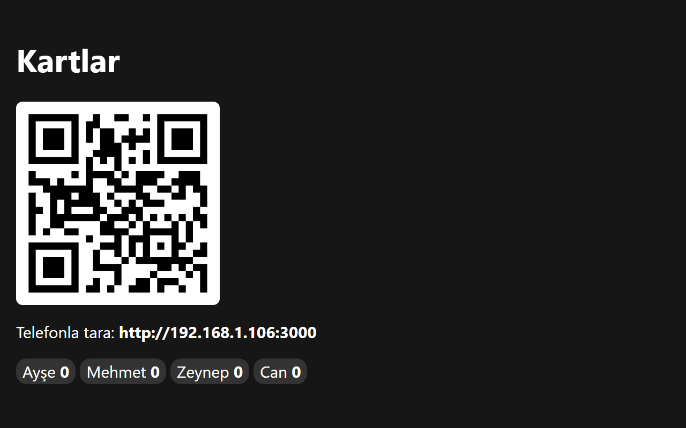
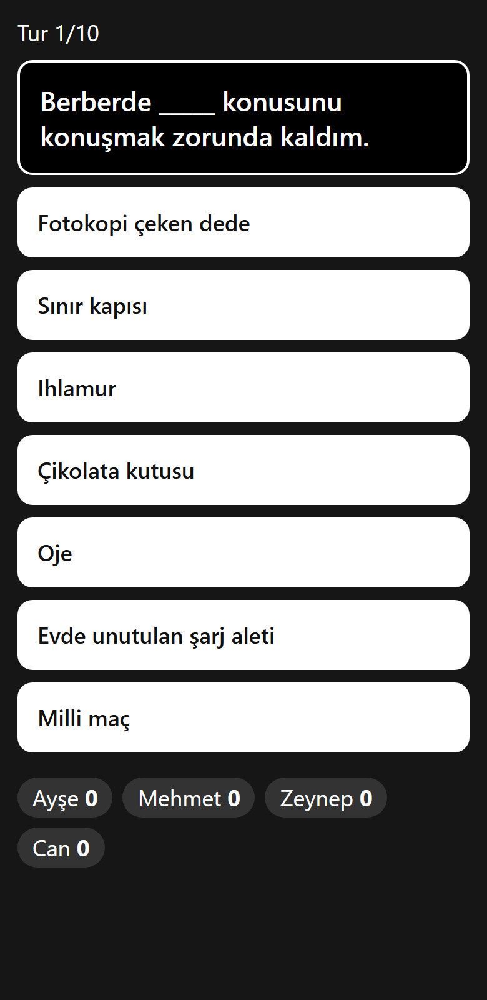
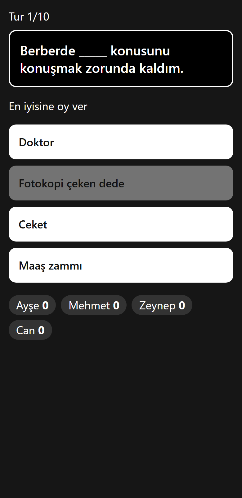
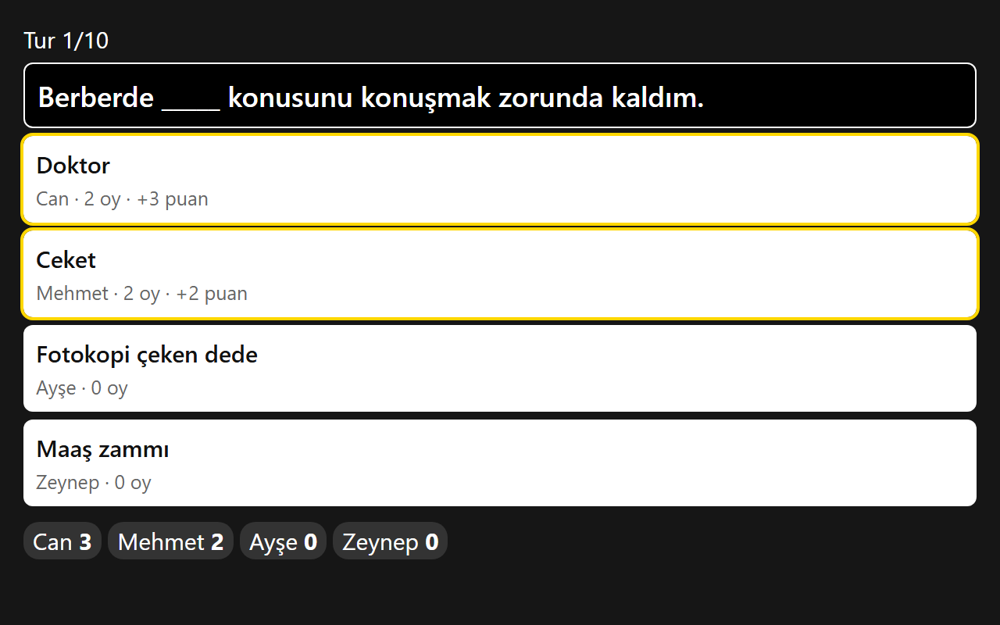

# Cards Against Humanity (Local)

Aynı wifi üzerinde oynanan, Türkçe Cards Against Humanity benzeri parti oyunu. Oyun TV'ye yansıtılır, oyuncular telefonlarından katılır. Bağımlılık yok, sadece Node.js yeterli.

## Ekran görüntüleri

**TV: lobi.** Oyuncular QR kodu okutarak katılır.



**Telefon: kart seçimi ve oylama**

 

**TV: tur sonucu.** En çok oy alan ilk 3 kart 3 / 2 / 1 puan alır.



## Çalıştırma

```
node server.js
```

Konsolda üç adres çıkar:

| Sayfa | Adres | Kim kullanır |
|-------|-------|--------------|
| TV | `http://localhost:3000/tv` | TV'ye yansıtılan ekran, lobide QR kod gösterir |
| Admin | `http://localhost:3000/admin` | Oyunu yöneten kişi |
| Oyuncu | `http://<LAN-IP>:3000` | Telefonlar (QR kodu okutarak da açılır) |

Ayarlar (opsiyonel):

```
ADMIN_PIN=4321 PORT=8080 node server.js
```

Varsayılan admin PIN'i `1234`, port `3000`. Windows firewall sorarsa "Özel ağ" için izin ver.

## Nasıl oynanır

1. Oyuncular QR kodu okutup isim yazarak katılır (en az 3 kişi).
2. Admin sayfasında PIN yazılıp **Başlat**'a basılır.
3. Herkese 7 beyaz kart verilir, TV'de bir siyah kart çıkar. Herkes boşluğa en uygun beyaz kartı seçer.
4. Seçilen kartlar isimsiz gösterilir, herkes kendi kartı hariç en iyisine oy verir.
5. En çok oy alan ilk 3 kart sırasıyla 3 / 2 / 1 puan alır, kart sahipleri açıklanır.
6. Admin **Sonraki tur**'a basar. 10 tur sonunda oyun biter.

Admin, her aşamada **Oylamaya geç** / **Sonucu göster** ile bekleyenleri beklemeden ilerletebilir. **Yeniden başlat** skorları sıfırlar ve lobiye döner, oyuncular listede kalır.

## Dosyalar

- `server.js`: HTTP sunucusu, oyun durumu, SSE ile canlı güncelleme
- `index.html`: TV, admin ve oyuncu ekranlarının hepsi (adrese göre rol seçilir)
- `cards.json`: 200 siyah, 800 beyaz kart
- `qr.js`: [qrcode-generator](https://github.com/kazuhikoarase/qrcode-generator) (MIT), QR kod için, internetsiz çalışır

## Kart eklemek

`cards.json` içindeki `black` ve `white` listelerine satır ekle. Siyah kartlarda boşluk `___` ile yazılır, her kartta tam bir tane olmalı. JSON'da son elemandan sonra virgül koyma.

## Sınırlar

- Durum bellekte tutulur, sunucu kapanınca oyun sıfırlanır.
- Eşit oy durumunda puan paylaşılmaz, sıralamaya göre verilir.
- Tur sayısı, el boyutu ve minimum oyuncu `server.js` başındaki sabitlerde (`ROUNDS`, `HAND`, `MIN`).
